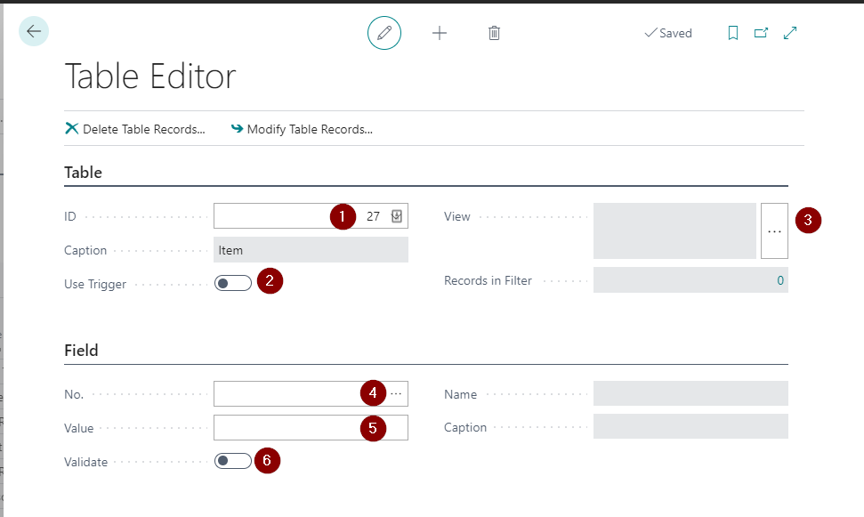
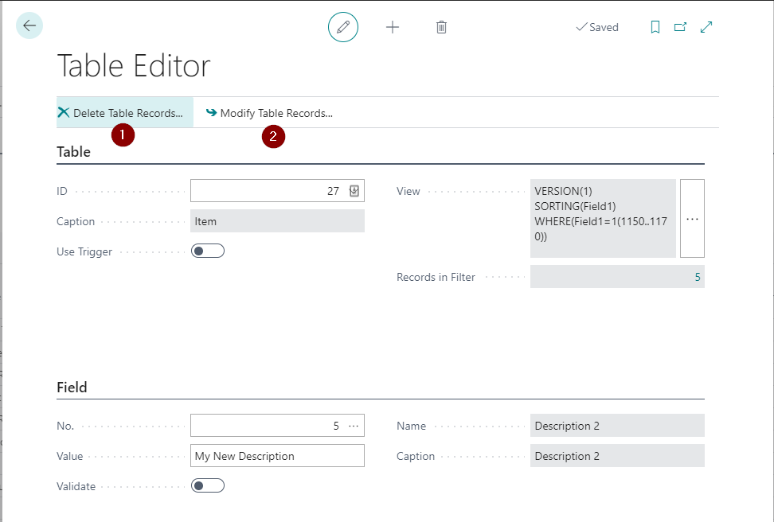
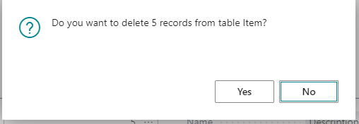
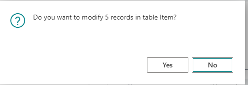

# Table-Editor

 

 1) ID: This is preselected with the table that you selected in the table overview. It is the table where you want to edit or delete records.
 2) Use Trigger: If enabled, the table triggers OnModify/OnDelete will be used when deleting or modifying records.
 3) View: Opens a request page to filter the records that you want to modify or delete.
 4) No.: If you want to modify a field in your filtered records, select the field here.
 5) Value: The new value for the selected field after modifying the records.
 6) Validate: If enabled, the OnValidate trigger of the field will be used when modifying the records.

After you have set your values, use the actions "Delete Table Records" or "Modify Table Records" to delete or modify the records. A confirmation dialog will appear before the operation is being executed.

 

 When deleting:

 

 When modifying:

 

